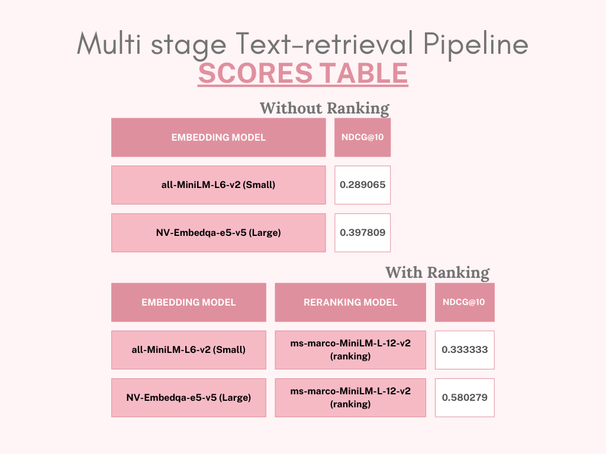

# Multi-Stage Text Retrieval Pipeline for Question-Answering (Q&A) Tasks

## Overview
This project implements a multi-stage text retrieval pipeline for question-answering (Q&A) tasks. The pipeline leverages both embedding models and ranking models to improve retrieval accuracy. The goal is to benchmark different models, analyze their effectiveness, and understand trade-offs between model size, accuracy, and performance.

## Dataset
- Used the **FiQA** dataset from the BEIR benchmark.
- Preprocessed and tokenized passages, ensuring a maximum length of 512 tokens.

## Pipeline Stages
1. **Candidate Retrieval (Embedding Models):**
   - **Small Model**: `all-MiniLM-L6-v2`
   - **Large Model**: `nv-embedqa-e5-v5`
   - Top-k relevant passages were retrieved based on cosine similarity between query and passage embeddings.

2. **Reranking (Ranking Models):**
   - **Small Ranking Model**: `ms-marco-MiniLM-L-12-v2`
   - The retrieved passages were reranked based on their relevance scores generated by the ranking model.

## Evaluation Metrics
- **NDCG@10**: Used to evaluate the effectiveness of the retrieval and reranking stages.
- Comparison between using embedding models alone and with reranking.

## Results Summary


## Conclusion
- **Embedding Models** alone provide a strong baseline for candidate retrieval.
- Incorporating a **ranking model** significantly improves the retrieval accuracy.
- The larger embedding model (`nv-embedqa-e5-v5`) generally performs better but comes with increased computational costs.
- This project showcases the trade-offs between model size, accuracy, and processing time in multi-stage retrieval systems.

## How to Run
1. Install dependencies:
   ```bash
   pip install sentence-transformers transformers scikit-learn
   ```
2. Load and preprocess the dataset.
3. Run the candidate retrieval with the chosen embedding model.
4. Apply reranking using the selected ranking model.
5. Evaluate using NDCG@10.

## Future Work
- Experiment with different ranking models like `nv-rerankqa-mistral-4b-v3`.
- Apply this pipeline to other datasets from the BEIR benchmark for generalization.
- Optimize the pipeline for real-time question-answering applications.
